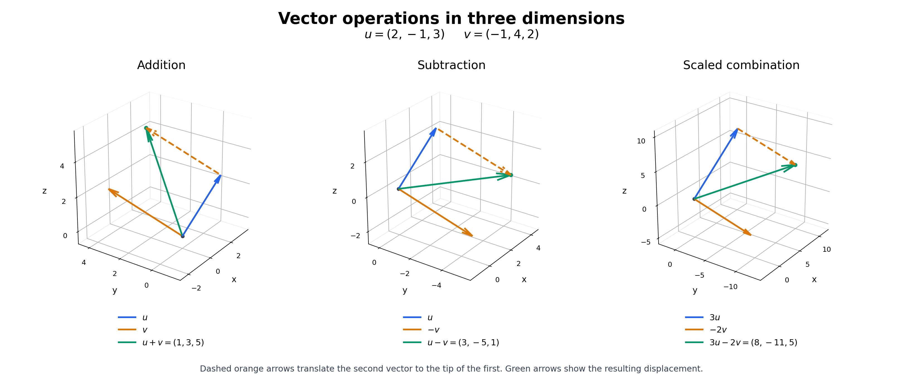

### Exercise 1. Vector Operations and Their Meaning

For $u=(2,-1,3)$ and $v=(-1,4,2)$ compute

$$
u+v,\qquad u-v,\qquad 3u-2v.
$$

Then verify that $(u+v)-v=u$, and explain geometrically what adding two vectors means.

> **Why this exercise:** reinforces basic operations and immediately connects them with their geometric meaning.

## Solution

Vector operations are performed coordinate by coordinate:

$$
u+v=(1,3,5),\qquad u-v=(3,-5,1),
$$

$$
3u-2v=(6,-3,9)-(-2,8,4)=(8,-11,5).
$$

The requested check gives

$$
(u+v)-v=(1,3,5)-(-1,4,2)=(2,-1,3)=u.
$$

Geometrically, adding vectors means placing the tail of the second vector at the head of the first; the sum is the displacement from the original tail to the final head (equivalently, the diagonal of the parallelogram).

### 3D illustration

The blue and orange arrows are the vectors being combined; the green arrow is their sum. The dashed orange arrow places the second vector at the tip of the first without changing its length or direction. Subtraction uses $u-v=u+(-v)$, and the third panel adds $3u$ and $-2v$. Each panel uses equal scales on its three axes; the panels use different ranges to fit their vectors.
